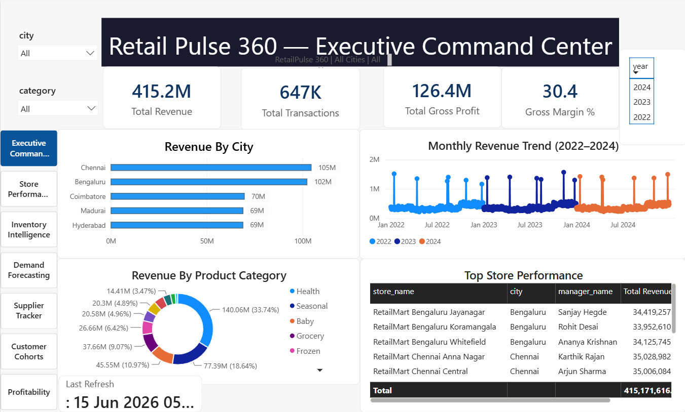
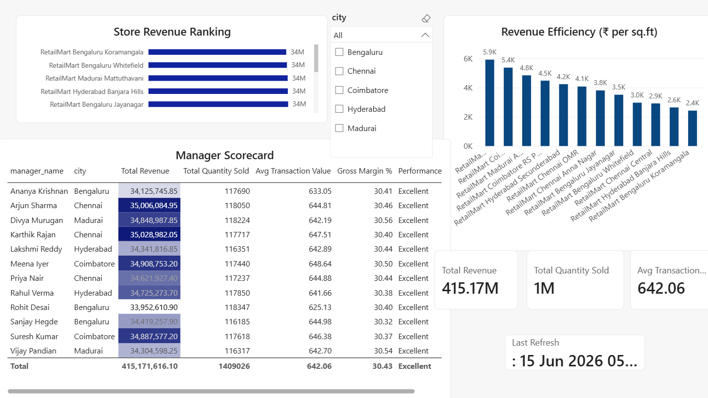
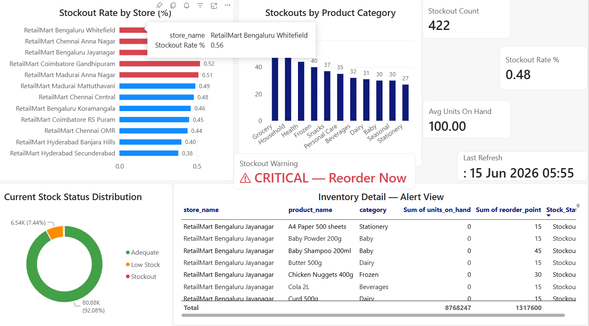
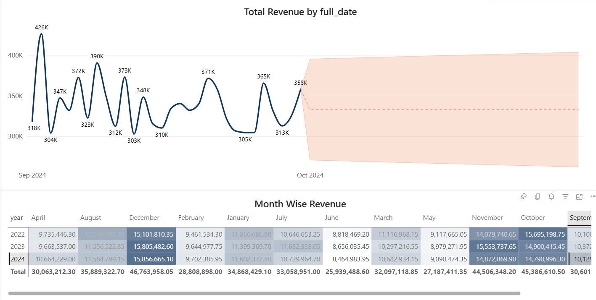
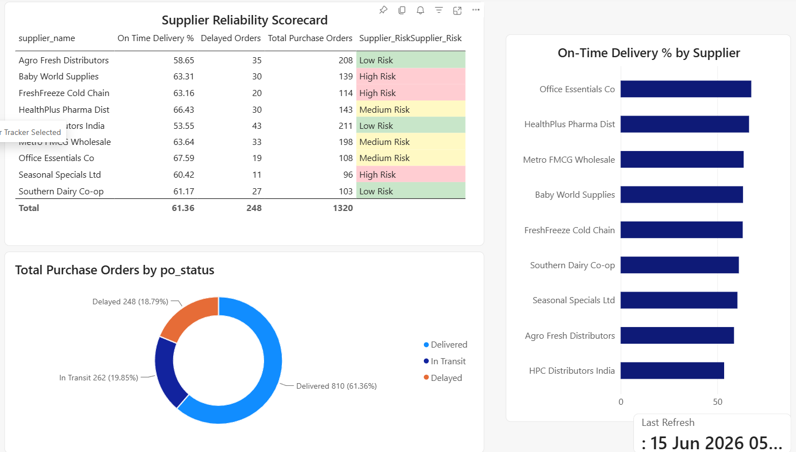
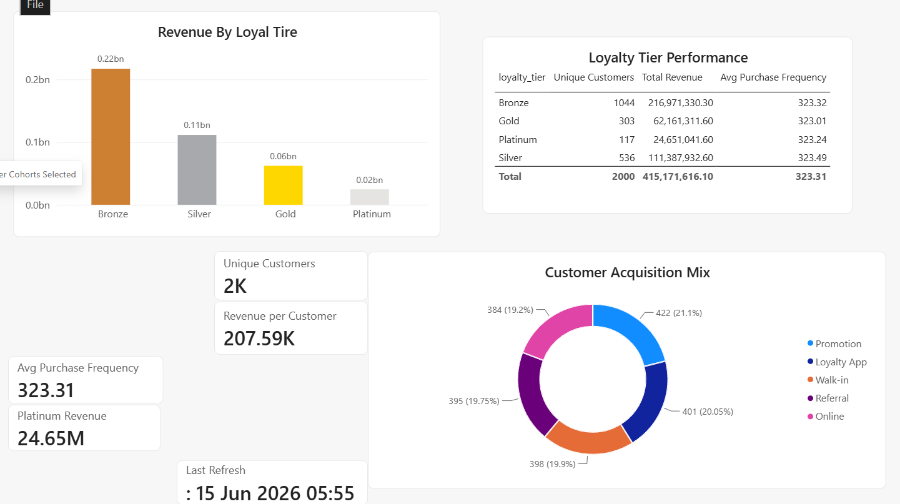
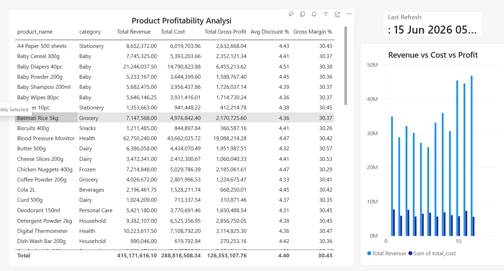

<div align="center">


<br/>


<br/>

> ### *"Transforming 646,000+ retail transactions into executive-grade business decisions"*

<br/>

[](https://github.com/SriRahulP/RetailPulse360)
[](https://www.linkedin.com/in/srirahulp2005)
[](https://app.powerbi.com/groups/me/reports/09d2ac1c-2726-49f5-95b4-7988ae63bb66/7cefead76b8f1f7831b0?experience=power-bi
)

</div>

---

## 📌 The Business Problem

<table>
<tr>
<td width="60%">

The **global retail industry loses $1.75 trillion annually** due to inventory distortion — a combination of stockouts and overstocks — while **58% of retailers operate with inventory accuracy below 80%** *(IHL Group, 2024)*.

The root cause is not bad products or bad customers. It is **disconnected data, siloed reporting, and zero real-time visibility** — forcing management to make million-dollar decisions based on gut feeling and outdated Excel files.

**RetailPulse 360** was engineered to solve exactly this problem.

</td>
<td width="40%">

| Problem | Annual Loss |
|---------|------------|
| 🔴 Stockouts | $1.20 Trillion |
| 🟡 Overstocks | $0.55 Trillion |
| **Total** | **$1.75 Trillion** |

*Source: IHL Group Retail Research, 2024*

</td>
</tr>
</table>

---

## 💡 The Solution

> **RetailPulse 360** is an end-to-end Business Intelligence platform simulating **RetailMart India** — a 12-store retail chain operating across **Chennai, Bengaluru, Hyderabad, Coimbatore, and Madurai** — built to eliminate data silos and convert raw operational data into real-time executive decisions.

This is not a dashboard. This is a **decision intelligence system** that answers:

- 📊 *What is happening?* → Real-time KPIs across all 12 stores
- 🔍 *Why is it happening?* → Drill-through, decomposition tree, AI insights
- 🔮 *What will happen next?* → 90-day AI-powered demand forecasting
- ✅ *What should we do?* → Actionable alerts, supplier risk flags, stockout warnings

---

## 🏗️ System Architecture

```
┌─────────────────────────────────────────────────────────────────┐
│                     RAW DATA SOURCES                            │
│   Sales Transactions · Inventory · Suppliers · Customers        │
│   Stores · Purchase Orders · Festival Calendar · GST Data       │
└───────────────────────────┬─────────────────────────────────────┘
                            │
                            ▼
┌─────────────────────────────────────────────────────────────────┐
│              PostgreSQL DATABASE (retailpulse_db)               │
│         Schema: retail | 9 Tables | 735,000+ Records           │
└───────────────────────────┬─────────────────────────────────────┘
                            │
                            ▼
┌─────────────────────────────────────────────────────────────────┐
│                  POWER QUERY — ETL PIPELINE                     │
│   Null Removal · Type Correction · Deduplication               │
│   GST Enrichment · Custom Columns · Query Folding              │
└───────────────────────────┬─────────────────────────────────────┘
                            │
                            ▼
┌─────────────────────────────────────────────────────────────────┐
│              STAR SCHEMA DATA MODEL                             │
│   3 Fact Tables  ·  6 Dimension Tables  ·  12 Relationships    │
│   Conformed Dimensions  ·  Surrogate Integer Keys              │
└───────────────────────────┬─────────────────────────────────────┘
                            │
                            ▼
┌─────────────────────────────────────────────────────────────────┐
│                   DAX MEASURES LAYER                            │
│         51 Measures · Time Intelligence · RFM · Forecasting    │
│         VAR Optimization · CALCULATE · SUMX · RELATED          │
└───────────────────────────┬─────────────────────────────────────┘
                            │
                            ▼
┌─────────────────────────────────────────────────────────────────┐
│              POWER BI DASHBOARDS (7 Pages)                      │
│    Role-Based · Drill-through · Bookmarks · Tooltips           │
│    Row Level Security · AI Forecast · Conditional Formatting   │
└───────────────────────────┬─────────────────────────────────────┘
                            │
                            ▼
┌─────────────────────────────────────────────────────────────────┐
│              POWER BI SERVICE — DEPLOYMENT                      │
│    Daily Scheduled Refresh · On-premises Gateway               │
│    RLS Roles Assigned · Shareable Link · Workspace Published   │
└─────────────────────────────────────────────────────────────────┘
```

---

## 📊 Dashboard Pages

<table>
<thead>
<tr>
<th>#</th>
<th>Dashboard Page</th>
<th>Business User</th>
<th>Key Questions Answered</th>
</tr>
</thead>
<tbody>
<tr>
<td>1️⃣</td>
<td><b>Executive Command Center</b></td>
<td>CEO</td>
<td>Total revenue · YoY growth · City heatmap · Top stores</td>
</tr>
<tr>
<td>2️⃣</td>
<td><b>Store Performance Scorecard</b></td>
<td>Regional Manager</td>
<td>Store ranking · Manager efficiency · Revenue per sq.ft</td>
</tr>
<tr>
<td>3️⃣</td>
<td><b>Inventory Intelligence</b></td>
<td>Supply Chain Head</td>
<td>Stockout alerts · Days on hand · Reorder warnings</td>
</tr>
<tr>
<td>4️⃣</td>
<td><b>Demand Forecasting</b></td>
<td>Procurement Team</td>
<td>90-day AI forecast · Seasonal patterns · Festival spikes</td>
</tr>
<tr>
<td>5️⃣</td>
<td><b>Supplier Reliability Tracker</b></td>
<td>Purchase Manager</td>
<td>On-time delivery % · Delay analysis · Risk scoring</td>
</tr>
<tr>
<td>6️⃣</td>
<td><b>Customer Cohort Analysis</b></td>
<td>Marketing Head</td>
<td>RFM segmentation · CLV · Loyalty tier performance</td>
</tr>
<tr>
<td>7️⃣</td>
<td><b>Profitability Deep-Dive</b></td>
<td>CFO</td>
<td>Gross margin · Markdown rate · Category profitability</td>
</tr>
</tbody>
</table>

---

## 🗃️ Data Model — Star Schema

```
                         ┌─────────────┐
                         │  Dim_Date   │
                         │  date_key   │
                         │  full_date  │
                         │  festivals  │
                         └──────┬──────┘
                                │
         ┌──────────────────────┼──────────────────────┐
         │                      │                      │
┌────────┴───────┐    ┌─────────┴────────┐    ┌────────┴───────┐
│  Dim_Product   │    │   FACT_SALES     │    │  Dim_Customer  │
│  product_key   │───▶│  646,629 rows    │◀───│  customer_key  │
│  category      │    │  ─────────────  │    │  loyalty_tier  │
│  brand · mrp   │    │  revenue · cost  │    │  RFM segment   │
│  gst_slab      │    │  gross_profit    │    └────────────────┘
└────────────────┘    │  quantity        │
                      │  discount_pct    │
┌────────────────┐    └─────────┬────────┘
│  Dim_Supplier  │              │
│  supplier_key  │              ▼
│  reliability   │    ┌─────────────────┐
│  lead_time     │    │   Dim_Store     │
└────────┬───────┘    │   store_key     │
         │            │   city · zone   │
         │            │   manager_name  │
         ▼            └────────┬────────┘
┌────────────────┐             │
│Fact_PurchaseOrders│          ▼
│  1,320 rows    │    ┌─────────────────┐
│  po_status     │    │   Dim_Region    │
│  delay_days    │    │   tier_level    │
└────────────────┘    └─────────────────┘
         
┌────────────────────┐
│   Fact_Inventory   │
│   87,840 rows      │
│   units_on_hand    │
│   Stock_Status     │
│   is_stockout      │
└────────────────────┘
```

**3 Fact Tables · 6 Dimension Tables · 12 Active Relationships**
All relationships: One-to-Many · Single filter direction · Integer surrogate keys

---

## 📏 Key KPIs Tracked

<table>
<tr>
<td>

**Revenue & Growth**
- Total Revenue (MTD/QTD/YTD)
- Year-over-Year Growth %
- Month-over-Month Growth %
- Revenue per Square Foot
- Revenue Contribution %

</td>
<td>

**Inventory**
- Stockout Rate %
- Days Inventory Outstanding
- Inventory Turnover Ratio
- Fill Rate %
- Inventory Value at Risk

</td>
<td>

**Customer**
- Customer Lifetime Value
- RFM Score
- Loyalty Tier Revenue %
- Purchase Frequency
- New vs Returning Revenue

</td>
</tr>
<tr>
<td>

**Supplier**
- On-Time Delivery %
- Average Delay Days
- Supplier Risk Score
- PO Fill Rate %

</td>
<td>

**Profitability**
- Gross Margin %
- Discount Impact (₹)
- Profit per Transaction
- Category Margin Analysis

</td>
<td>

**Operations**
- Avg Transaction Value
- Avg Basket Size
- Festival Revenue Impact
- Store Efficiency Index

</td>
</tr>
</table>

---

## ⚡ Advanced Features

| Feature | Implementation | Business Value |
|---------|---------------|----------------|
| **Row Level Security** | 6 roles — CEO, CFO, Store Manager, Regional Managers using `USERPRINCIPALNAME()` | Data governance — each user sees only authorized data |
| **Drill-through** | City detail page + Product category detail page | One-click deep dive from summary to specifics |
| **Bookmarks** | Year switcher buttons (2022 / 2023 / 2024 / All) | Instant historical comparison without slicer interaction |
| **AI Forecasting** | 90-day demand forecast · 95% confidence interval · Auto seasonality | Procurement planning based on predicted demand |
| **Custom Tooltips** | Mini dashboard popup on hover | Context without page navigation |
| **What-If Parameters** | Revenue target slider | Scenario planning for executive decisions |
| **Scheduled Refresh** | Daily 6 AM IST via on-premises gateway | Always fresh data without manual intervention |
| **Performance Optimization** | VAR usage · Query folding · Interaction pruning · Sub-2s load | Production-ready report performance |
| **Conditional Formatting** | Icon sets · Color scales · Data bars · Rule-based colors | Instant visual pattern recognition |
| **Dynamic Titles** | DAX-powered titles that change with slicer selection | Personalized experience per user |

---

## 🛠️ Technology Stack

<table>
<tr>
<th>Layer</th>
<th>Technology</th>
<th>Purpose</th>
</tr>
<tr>
<td>Database</td>
<td>PostgreSQL 16</td>
<td>Production-grade relational database hosting all 9 tables</td>
</tr>
<tr>
<td>Data Simulation</td>
<td>Python (psycopg2 · Faker · NumPy · Pandas)</td>
<td>Generating 735K+ realistic Indian retail records</td>
</tr>
<tr>
<td>ETL</td>
<td>Power Query (M Language)</td>
<td>Data cleaning, transformation, and enrichment pipeline</td>
</tr>
<tr>
<td>Data Modeling</td>
<td>Star Schema</td>
<td>Dimensional modeling with conformed dimensions</td>
</tr>
<tr>
<td>Analytics</td>
<td>DAX (51 measures)</td>
<td>Time intelligence, RFM, forecasting, KPI calculations</td>
</tr>
<tr>
<td>Visualization</td>
<td>Power BI Desktop</td>
<td>7 role-based interactive dashboard pages</td>
</tr>
<tr>
<td>Deployment</td>
<td>Power BI Service + On-premises Gateway</td>
<td>Cloud publishing with daily scheduled refresh</td>
</tr>
<tr>
<td>Version Control</td>
<td>GitHub</td>
<td>Project documentation and portfolio showcase</td>
</tr>
</table>

---

## 📈 Business Impact Delivered

```
┌─────────────────────────────────────────────────────────────┐
│                  SIMULATED BUSINESS OUTCOMES                │
├─────────────────────────────────────────────────────────────┤
│                                                             │
│  ⚠️  Early Warning System                                   │
│     Flags any SKU with < 7 days stock remaining            │
│     → Prevents stockout before it happens                  │
│                                                             │
│  📦  Supplier Risk Scoring                                  │
│     Identifies high-risk vendors causing shelf gaps        │
│     → Enables proactive supplier management                │
│                                                             │
│  👥  RFM Customer Segmentation                              │
│     Reveals top customer segments driving revenue          │
│     → Enables targeted loyalty program investment          │
│                                                             │
│  🔮  90-Day Demand Forecast                                 │
│     Predicts future demand with 95% confidence             │
│     → Reduces over-procurement and waste                   │
│                                                             │
│  📊  Single Source of Truth                                 │
│     Replaces 15 disconnected Excel files                   │
│     → One platform, one version of truth                   │
│                                                             │
└─────────────────────────────────────────────────────────────┘
```

---

## 📸 Dashboard Screenshots

### 🎯 Executive Command Center
> *The CEO's single view of business health — revenue, growth, and city performance at a glance*



---

### 🏪 Store Performance Scorecard
> *Regional managers track store rankings, manager efficiency, and revenue per square foot*



---

### 📦 Inventory Intelligence
> *The early warning system — stockout alerts, stock status distribution, and days on hand*



---

### 🔮 Demand Forecasting
> *AI-powered 90-day demand forecast with 95% confidence interval and seasonal pattern detection*



---

### 🚚 Supplier Reliability Tracker
> *On-time delivery scoring, delay analysis, and supplier risk classification*



---

### 👥 Customer Cohort Analysis
> *RFM segmentation, loyalty tier performance, and customer lifetime value analysis*



---

### 💰 Profitability Deep-Dive
> *Gross margin by category, markdown impact, and product-level profitability*



---

### 🔗 Star Schema Data Model
> *12 active relationships — all one-to-many, single direction, integer surrogate keys*


---

## 🗂️ Repository Structure

```
RetailPulse360/
│
├── 📁 01_Database/
│   └── schema.sql                    # PostgreSQL schema — all 9 tables
│                                     # with data types, PKs, FKs
│
├── 📁 02_SQL_Queries/
│   └── business_queries.sql          # 12 business queries
│                                     # Level 1: Basic · Level 2: Window
│                                     # functions · Level 3: CTEs
│
├── 📁 03_DAX_Measures/
│   └── measures.txt                  # 51 DAX measures documented
│                                     # with purpose, logic, and usage
│
├── 📁 04_Screenshots/
│   ├── page1_executive_command_center.png
│   ├── page2_store_performance.png
│   ├── page3_inventory_intelligence.png
│   ├── page4_demand_forecasting.png
│   ├── page5_supplier_tracker.png
│   ├── page6_customer_cohorts.png
│   ├── page7_profitability.png
│   └── model_view.png
│
├── 📁 05_Documentation/
│   └── architecture_notes.txt        # Design decisions and rationale
│
└── 📄 README.md                      # This file
```

---

## 🧠 DAX Concepts Demonstrated

```
✅ SUM · AVERAGE · COUNT · COUNTROWS · DISTINCTCOUNT
✅ CALCULATE — context modification (most important DAX function)
✅ ALL · ALLEXCEPT — filter removal for ratio calculations
✅ VAR / RETURN — variables for performance and readability
✅ SAMEPERIODLASTYEAR — year-over-year comparison
✅ TOTALYTD · TOTALQTD · TOTALMTD — period-to-date calculations
✅ DATEADD · DATESINPERIOD — dynamic date range windows
✅ SUMX · AVERAGEX — row-by-row iterator functions
✅ TOPN — top N ranking calculations
✅ RELATED — cross-table value lookup inside row context
✅ SELECTEDVALUE — single slicer value extraction
✅ IF · SWITCH · nested logic — conditional business rules
✅ FORMAT — number and date formatting as text
✅ DIVIDE — safe division with zero-error handling
✅ ISBLANK — null and empty result handling
✅ USERPRINCIPALNAME — dynamic RLS based on logged-in user
```

---

## 🎯 SQL Concepts Demonstrated

```
✅ GROUP BY with multiple aggregations
✅ INNER JOIN across 4+ tables simultaneously
✅ Window Functions — RANK() OVER (PARTITION BY)
✅ Running Total — SUM() OVER (ORDER BY with ROWS clause)
✅ CTEs (Common Table Expressions) — WITH clause
✅ FILTER with HAVING clause
✅ CASE WHEN conditional aggregation
✅ FILTER() with aggregate functions
✅ NULLIF() for safe division
✅ DATE arithmetic and interval calculations
✅ CREATE VIEW for reusable business logic
✅ UNION ALL for combined result sets
```

---

## 🏃 How to Reproduce This Project

### Prerequisites
```
✅ PostgreSQL 16 installed
✅ Python 3.10+ with pip
✅ Power BI Desktop (free)
✅ pgAdmin 4 (free)
```

### Step 1 — Database Setup
```sql
-- Run in pgAdmin Query Tool
CREATE DATABASE retailpulse_db;
\c retailpulse_db
-- Then run: 01_Database/schema.sql
```

### Step 2 — Install Python Libraries
```bash
pip install psycopg2-binary faker pandas numpy
```

### Step 3 — Run Data Simulation
```bash
# Update password in script first
python data_simulation.py
# Generates 735,000+ rows across all tables
```

### Step 4 — Connect Power BI
```
Get Data → PostgreSQL
Server:   localhost
Database: retailpulse_db
Mode:     Import
```

### Step 5 — Build the Model
```
Transform data → Apply all Power Query steps
Model View → Create 12 relationships
Mark Dim_Date as date table
```

---

## 🔗 Links

<div align="center">

| Resource | Link |
|----------|------|
| 📊 **Live Dashboard** | [View on Power BI Service](https://app.powerbi.com/groups/me/reports/09d2ac1c-2726-49f5-95b4-7988ae63bb66/7cefead76b8f1f7831b0?experience=power-bi) |
| 💼 **LinkedIn Profile** | [Connect with me](https://www.linkedin.com/in/srirahulp2005) |
| 📧 **Email** | rahulnjr111@gmail.com |

</div>

---

## About the Author

<div align="center">

**Sri Rahul P**

*BTech — Computer and Communication Engineering*
*Amrita Vishwa Vidyapeetham*

**Skills:** Power BI · PostgreSQL · SQL · Python · DAX · Data Modeling · ETL · Business Intelligence · Data Analytics · Star Schema · Data Warehousing · Data Science tools 

</div>

---

<div align="center">

### ⭐ If this project helped you, please star this repository ⭐

*Built with 💛 as a portfolio project demonstrating end-to-end BI development*
*for Data Analyst · BI Developer · Analytics Engineer roles*


</div>
